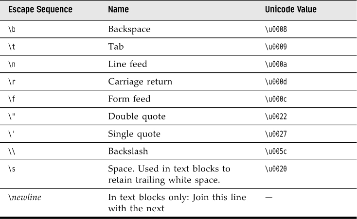

# Chapter 1 - Fundamental Structure of Java  
1. [A Simple Java Program](#11-a-simple-java-program)
2. [Comments](#12-comments)
3. [Data Types](#13-data-types)
4. Variables and Constants
5. Operators
6. Strings
7. Input and Output
8. Control Flow
9. Big Numbers 
10. Arrays
---
## 1.1 A simple Java Program
This is a very simple java program that prints a message to console. This program consist of a [class]() `SimpleJavaProgram`,
a [variable]() `greetings` of type [String]() and a [method]() `main`.
```java
// SimpleJavaProgram.java
public class SimpleJavaProgram {
    public static void main(String[] args) {
        String greetings = "Hello World";  // variable
        System.out.println(greetings); // printing on console
    }
}
// Hello World
```
General Program Structure :
```
public class ClassName {
        public static void main(String[] args){
            program statements
    }
}
```
## 1.2 Comments 
Comments in Java, as in most programming languages, do not show up in the
executable program. Thus, you can add as many comments as needed without
fear of bloating the code.

Java has three ways of marking comments.
### 1.2.1 Single Line Comment `//`.
The most common form is a `//`. Use this for a comment that runs from the `//` to the end
of the line.
```java
    System.out.println("We will not use 'Hello, World!'"); // is this too cute?
```
### 1.2.2 Multiline Comment `/* */`
```java
/*
        This is multiline comment,
        I use this to comment on multiple lines
 */
    System.out.println("We will not use 'Hello, World!'"); // is this too cute?
```
### 1.2.3 Generating Documentation `/** */`
Finally, a third kind of comment is used to generate documentation
automatically.

```java
/**
* This is the first sample program in Core Java Chapter 3
* @version 1.0.0 2022-06-24
* @author Owais Athar
*/
public class FirstSample {
    public static void main(String[] args) {
        System.out.println("We will not use 'Hello, World!'");
    }
}
```

## 1.3 Data Types 
Java is a _strongly typed language_. This means that every variable must have
a declared type. There are **eight** **[primitive types]()** in Java. Four of them are
**[integer](#131-integer-types)** types; two are **[floating-point]()** number types; one is the **[character]()** type
`char`, used for code units in the Unicode encoding scheme  and one is a [boolean]() type for truth values.

### 1.3.1 `Integer` Types
The `integer` types are for numbers without fractional parts. 
- Negative values are allowed. 
- Java provides the four `integer` types shown in the following table :

|Type|Storage Requirement|Range|
| --- | --- |---|
|`int`|4 bytes|-2,147,483648 to 2,147,483,647 (just over two billion)|
|`short`|2 bytes|-32,768 to 32,677 |
|`long`|8 bytes|-9,233,372,036,854,775,808 to 9,233,372,036,854,775,807 |
|`byte`|1 byte|-128 to 127|
- Long `integer` numbers have a suffix `L` or `l` (for example, `4000000000L`).
- Hexadecimal numbers have a prefix `0x` or `0X` (for example, `0xCAFE`).
- Octal numbers have a prefix `0` (for example, `010` is 8).
- You can write numbers in binary, with a prefix `0b` or `0B`. For example, `0b1001`
  is 9.
- You can add underscores to number literals, such as 1_000_000 (or
  0b1111_0100_0010_0100_0000) to denote one million. The underscores are for
  human eyes only. The Java compiler simply removes them.


> ⚠️ Under Java, the ranges of the `integer` types do not depend on the machine on
which you will be running the Java code.

### 1.3.2 Floating-Point Types
The floating-point types denote numbers with fractional parts.
- `float` - 4 bytes
- `double` - 8 bytes

- Numbers of type `float` have a suffix `F` or `f `(for example, `3.14F`).
- Floating-point numbers without an `F` suffix (such as 3.14) are always considered 
to be of type `double`.
- You can optionally supply the `D` or `d` suffix (for example, `3.14D`).

> ⚠️ **Cuation :** Floating-point numbers are not suitable for financial calculations in which
roundoff errors cannot be tolerated. For example, the command
System.out.println(2.0 - 1.1) prints 0.8999999999999999, not 0.9 as you
would expect. Such roundoff errors are caused by the fact that floating-point
numbers are represented in the binary number system. There is no precise
binary representation of the fraction 1/10, just as there is no accurate
representation of the fraction 1/3 in the decimal system. If you need precise
numerical computations without roundoff errors, use the BigDecimal class,
which is introduced later in this chapter


### 1.3.3 The `char` Type
The `char` type was originally intended to describe individual characters.
However, this is no longer the case. Nowadays, some Unicode characters can
be described with one `char` value, and other Unicode characters require two
`char` values.

Literal values of type `char` are enclosed in single quotes. For example, 'A' is
a character constant with value 65.

Escape Sequences for Special Characters



### 1.3.5 The boolean Type
The `boolean` type has two values, `false` and `true`. It is used for evaluating
logical conditions. You cannot convert between `integers` and `boolean` values.